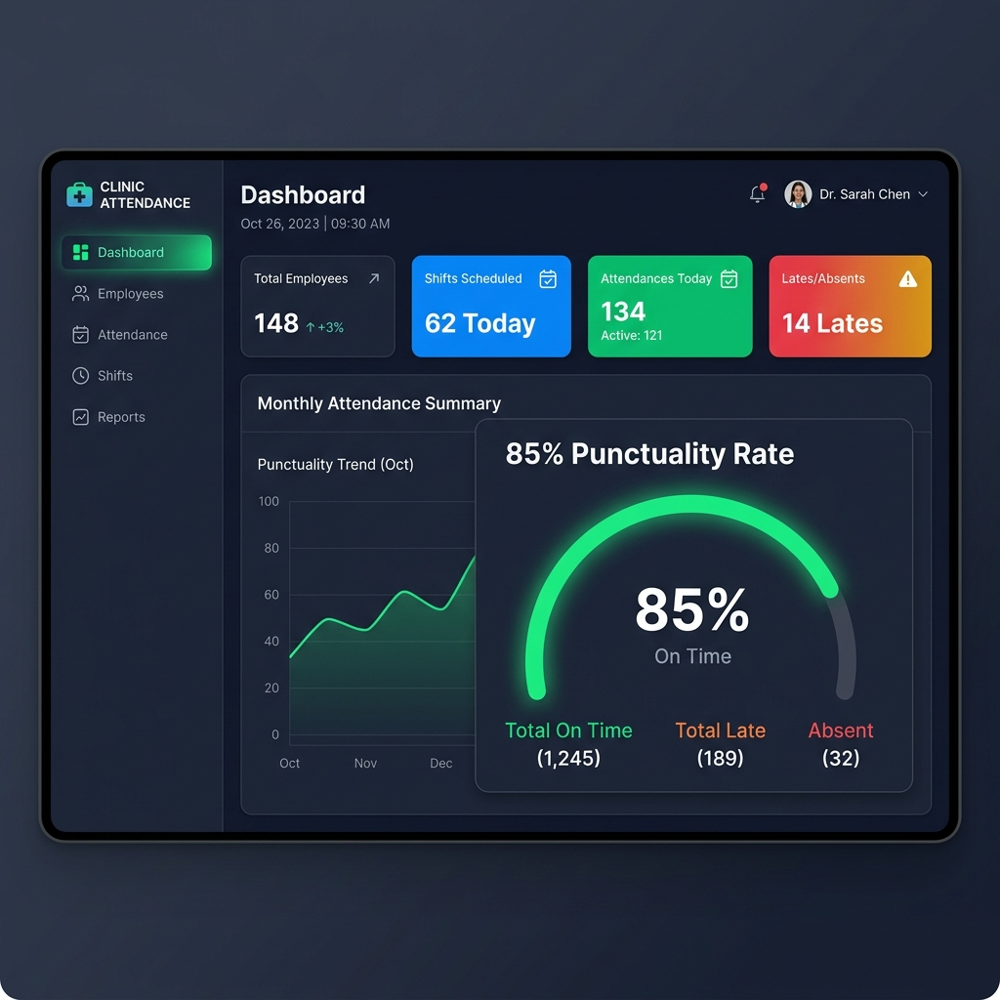
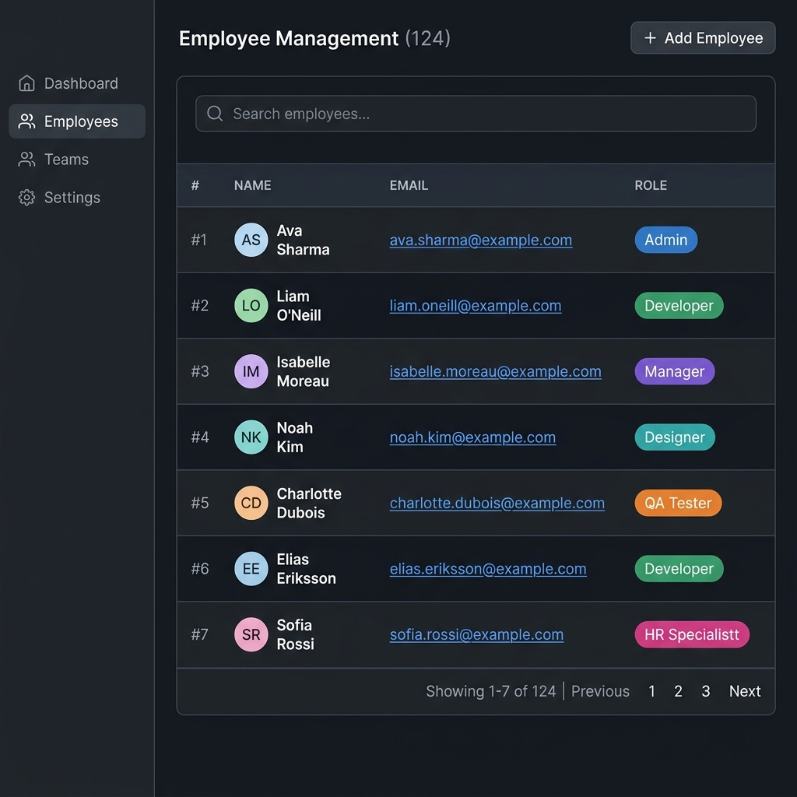
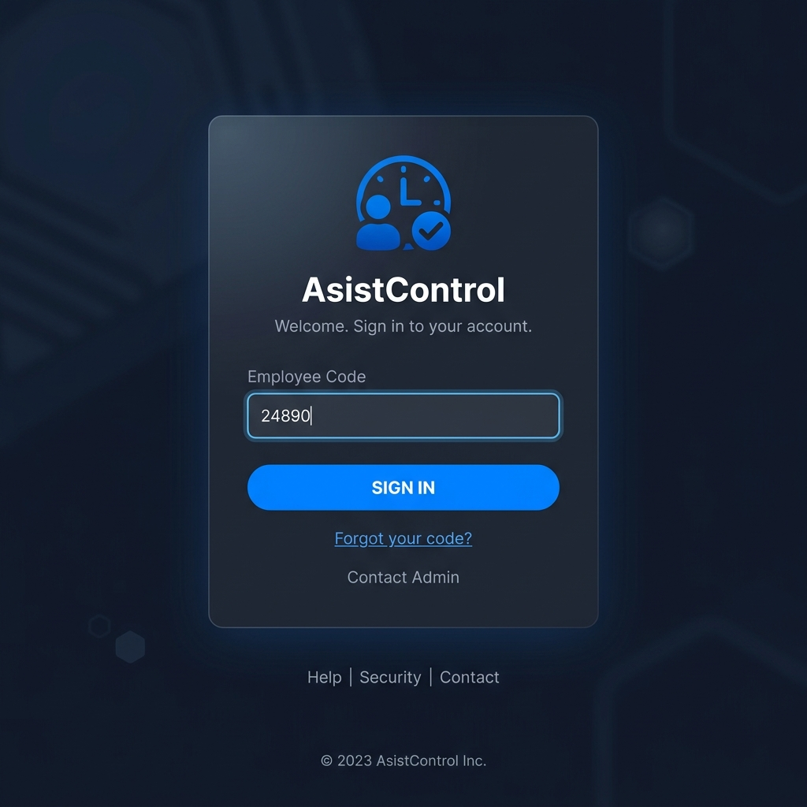
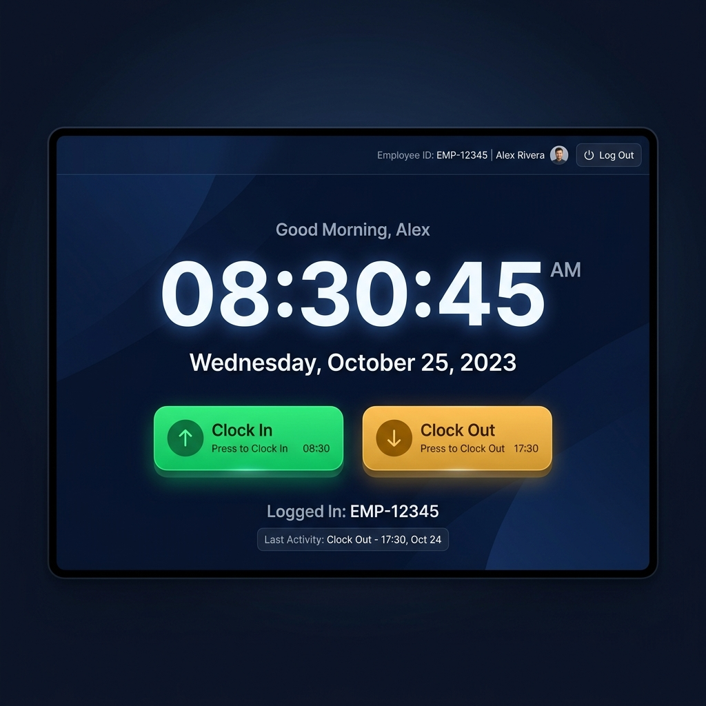

# Resultados

## Resultados esperados

- Sistema capaz de registrar empleados, turnos, asistencias y roles desde una interfaz web.
- Base de datos estructurada y consultable mediante rutas API.
- Pruebas automatizadas ejecutadas correctamente para reglas de tardanza, resumen y bordes.
- Aplicacion preparada para despliegue con Supabase y Vercel.

## Indicadores de exito

- Reduccion de errores de registro al centralizar la informacion en una base de datos.
- Mejora de trazabilidad al relacionar empleados, turnos y asistencias.
- Generacion de reportes rapidos y consistentes desde datos persistidos.
- Evidencia clara de SDD, Scrum, pruebas y despliegue en la documentacion del proyecto.

## Resultados obtenidos en el proyecto

- Se definio una estructura documental completa en Markdown para el informe final.
- Se implemento un MVP funcional con formularios para empleados, asistencia, turnos y roles.
- Se construyeron funciones puras para calcular tardanza, tiempo trabajado y resumen de asistencia.
- Se agregaron rutas API para consultar y registrar informacion con base de datos.
- Se preparo el esquema SQL y un archivo de semillas para una demostracion reproducible.

## Evidencia tecnica

- Validacion de sintaxis y tipado sin errores en el subproyecto.
- Pruebas unitarias para casos normales y bordes.
- Componentes de interfaz conectados a rutas API.
- Documentacion de despliegue y flujo de publicacion.

## Capturas de la Interfaz (UI)

A continuación, se presentan las capturas del resultado visual del rediseño del sistema:

### 1. Panel de Control (Dashboard)
El dashboard principal presenta las métricas del sistema y un resumen visual del estado de las tardanzas.

### 2. Gestión de Empleados y Registros
Las listas utilizan un componente de tablas avanzado con filtros, contadores dinámicos y "badges" de colores para distinguir estados (Ej. Puntual vs Tardanza).

### 3. Pantalla de Inicio de Sesión
El sistema cuenta con una pantalla de Login segura donde el empleado ingresa su código para acceder a su portal, separando así los roles administrativos de los usuarios finales.

### 4. Portal del Empleado (Kiosko)
Un terminal de autoservicio que muestra la hora en tiempo real y permite al trabajador registrar su entrada y salida mediante botones interactivos, los cuales confirman la hora exacta de la marcación.

